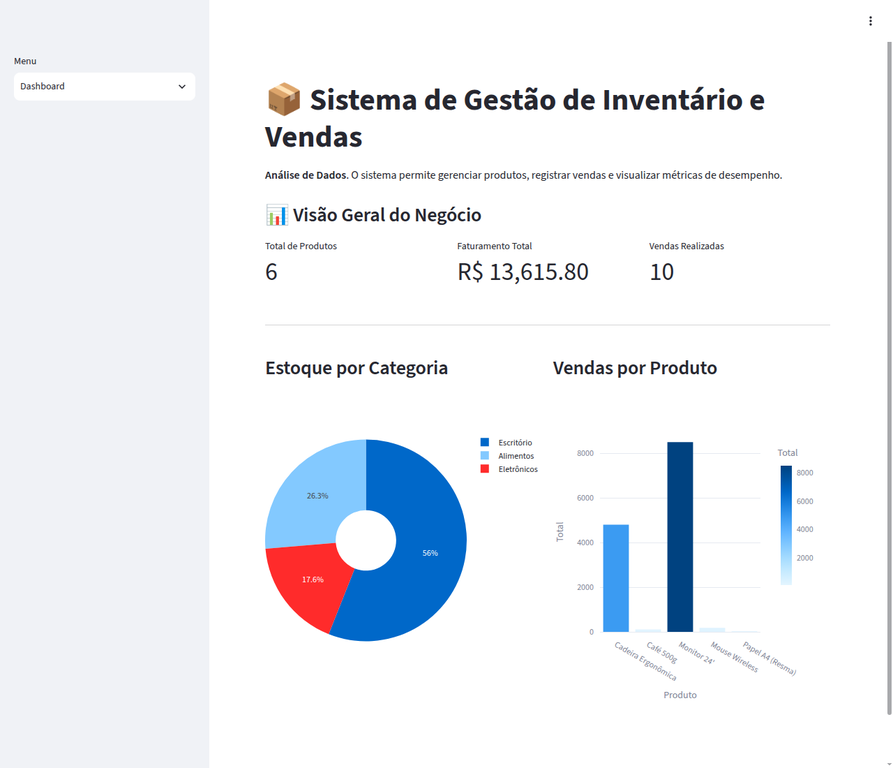
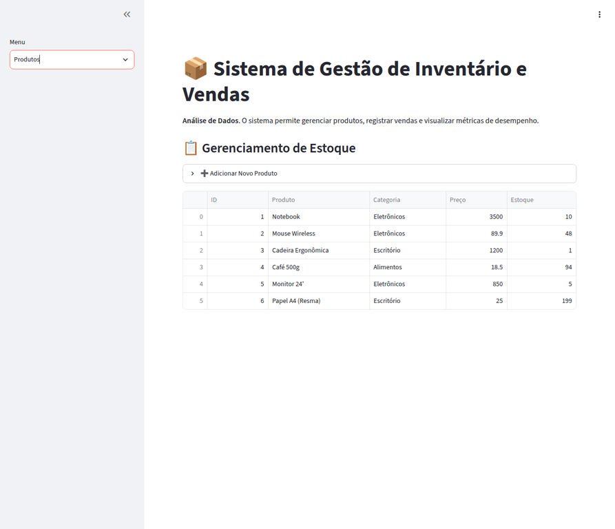
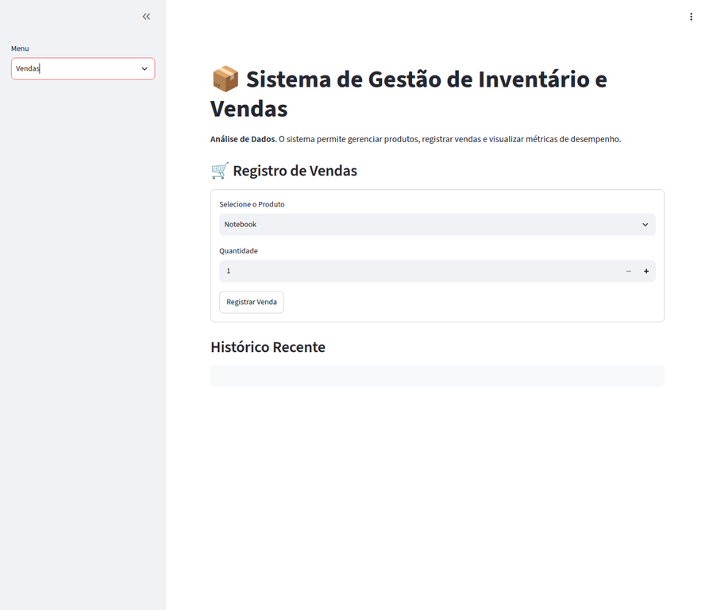

# Sistema de Gestão de Inventário Inteligente

[](https://www.python.org/)

[](https://streamlit.io/)

[](https://www.sqlite.org/)

Dashboard de gestão de inventário e vendas para pequenas e médias empresas. A aplicação usa Python, Streamlit, SQLite, Pandas e Plotly para acompanhar produtos, stock, vendas e indicadores num único painel.

## Demonstração visual

### Dashboard e métricas



### Gestão de produtos



### Registo de vendas



## Funcionalidades

- Dashboard com faturação, produtos, stock e vendas.
- Cadastro e consulta de produtos por categoria.
- Registo de vendas com verificação automática de stock.
- Gráficos Plotly para análise de stock e desempenho de vendas.
- Persistência local dos dados numa base SQLite.
- Script de seed para criar tabelas e carregar dados de exemplo.

## Tecnologias

| Tecnologia | Utilização |
| --- | --- |
| Python | Lógica da aplicação |
| Streamlit | Interface web interactiva |
| SQLite | Persistência local |
| Pandas | Tratamento e leitura dos dados |
| Plotly | Gráficos e visualizações |

## Como executar localmente

### 1. Clonar e instalar

```bash
git clone https://github.com/GustavoHCGit/sistema-gestao-inventario-inteligente.git
cd sistema-gestao-inventario-inteligente
python -m venv venv
# Linux/macOS
source venv/bin/activate
# Windows PowerShell: .\venv\Scripts\Activate.ps1
pip install -r requirements.txt
```

### 2. Carregar dados de demonstração

Antes de abrir o dashboard, execute o seed para criar as tabelas e carregar categorias, produtos e vendas de exemplo:

```bash
python seed_data.py
```

O script pode ser executado novamente para reconstruir a base local de demonstração quando necessário.

### 3. Iniciar a aplicação

```bash
streamlit run main.py
```

A aplicação será aberta no navegador em `http://localhost:8501`.

## Estrutura do projecto

```text
.
├── main.py
├── database.py
├── seed_data.py
├── streamlit_init.py
├── requirements.txt
├── dashboard_screenshot_1.webp
├── dashboard_screenshot_2.webp
├── dashboard_screenshot_3.webp
└── README.md
```

## Licença

Este projecto está disponível para fins de estudo e portfólio.
